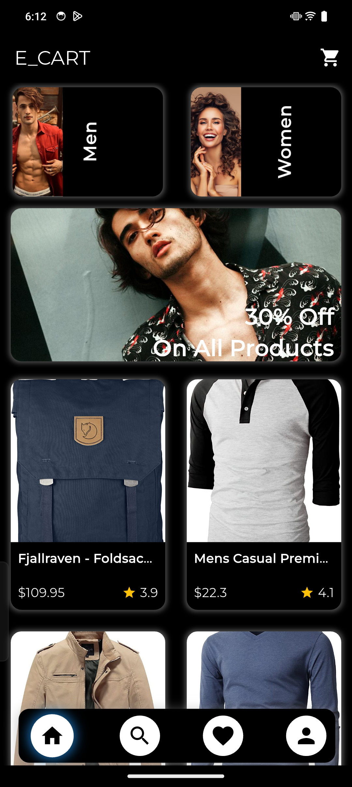
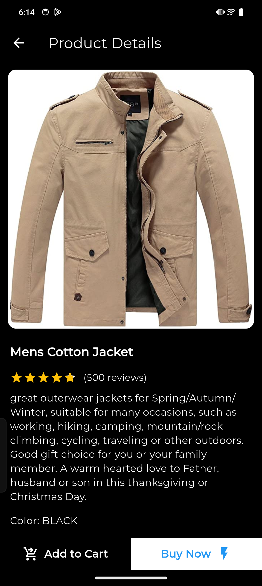
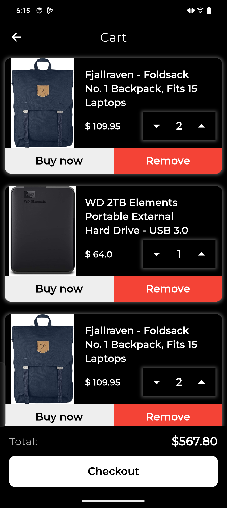

# 🛒 Flutter E-Commerce Application

A functional Flutter-based e-commerce application with modern UI with Animations,GetX state management, and Firebase integration for Login,MOKE API For Products(Http).

## 📌 Features
- 🛍️ Product Listings
- 🔍 Search Functionality
- 🛒 Add to Cart
- 🔐 User Authentication (Firebase)
- 🌙 Dark Theme

## 📸 Screenshots
[
[]()
]()

-Do checkout All the screenshots in the assets/screenshots folder.

## 🚀 Getting Started
### Prerequisites
- Flutter SDK installed
- Firebase setup (for authentication & database)
- IDE (VS Code or Android Studio)

### Installation
```sh
git clone https://github.com/amal945/machine_test_firebase_mock_api.git
cd flutter-ecommerce-app
flutter pub get
flutter run


📝 Test User Credentials

📧 Email: amalsaji332@gmail.com
🔑 Password: 12345678
